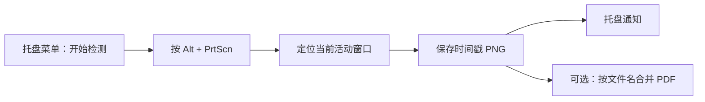

<div align="center">
  
  <h1>AltPrtScnCapture</h1>
  <p>一个轻量、免安装、隐私友好的 Windows 活动窗口截图与图片转 PDF 工具。</p>
  <p>
    <a href="https://github.com/zzzsssyyy1995/AltPrtScnCapture/releases/latest"><strong>下载最新版</strong></a>
    ·
    <a href="README.en.md">English</a>
  </p>

  
  
  
</div>

## 为什么做这个工具？

Windows 的 `Alt + PrtScn` 默认会把活动窗口复制到剪贴板，但连续整理截图时，仍需逐张粘贴和保存。AltPrtScnCapture 将这个流程变成一次按键：截图自动以 PNG 保存，并可随时把目录中的图片按文件名顺序合并成 PDF。

程序完全在本地运行，不上传截图，不要求管理员权限，也没有第三方运行时依赖。

## 功能亮点

- **全局快捷键**：监听 `Alt + PrtScn`，捕获当前活动窗口。
- **自动归档**：以 `Screenshot_yyyyMMdd_HHmmss.png` 命名；同秒截图会自动添加序号。
- **托盘常驻**：启动后不显示主窗口，所有操作均在系统托盘菜单完成。
- **手动启停**：程序启动时默认不监听，避免意外截屏。
- **目录记忆**：首次使用提示选择保存目录，之后自动记住设置。
- **一键合并 PDF**：按文件名排序处理 PNG、JPG、JPEG，每张图片生成一页 A4 PDF。
- **单文件运行**：图标和 PDF 生成能力均内嵌在 EXE 中。

## 快速开始

1. 前往 [Releases](https://github.com/zzzsssyyy1995/AltPrtScnCapture/releases/latest) 下载 Windows 压缩包。
2. 解压后双击 `AltPrtScnCapture.exe`。
3. 首次运行时选择截图保存目录；取消则使用系统“图片”文件夹。
4. 右击系统托盘中的蓝色窗口图标，选择“开始检测”。
5. 按 `Alt + PrtScn` 截取当前活动窗口。

> EXE 暂未进行商业代码签名。Windows SmartScreen 首次运行时可能提示“未知发布者”，请确认文件来自本仓库的 Release 页面。

## 托盘菜单

| 菜单项 | 作用 |
| --- | --- |
| 开始检测 | 注册 `Alt + PrtScn` 全局热键 |
| 停止检测 | 注销热键，停止自动截图 |
| 设置保存目录 | 选择并记住截图输出目录 |
| 合并为PDF | 将当前目录中的 PNG/JPG/JPEG 按文件名排序合并 |
| 退出 | 注销热键并关闭程序 |

## 工作流程



## 保存位置与文件格式

- 默认目录：Windows 系统“图片”文件夹。
- 设置文件：`%LOCALAPPDATA%\AltPrtScnCapture\settings.txt`。
- 截图文件：`Screenshot_20260811_143022.png`。
- PDF 文件：`Merged_20260811_143500.pdf`。
- PDF 页面：根据图片方向自动选择 A4 横向或纵向，并保持图片纵横比。

## 隐私与权限

- 所有截图和 PDF 均在本机处理，不连接网络、不上传文件。
- 程序不读取截图目录以外的用户文件。
- 不需要管理员权限，也不会随 Windows 自动启动。
- 仅当用户在托盘中选择“开始检测”后，才注册全局热键。

## 从源码构建

环境要求：Windows 10/11、.NET Framework 4.8。

```powershell
git clone https://github.com/zzzsssyyy1995/AltPrtScnCapture.git
cd AltPrtScnCapture
.\build.ps1
```

构建产物位于 `dist\AltPrtScnCapture.exe`。脚本调用 Windows 自带的 .NET Framework C# 编译器，不需要 NuGet 或额外 SDK。

## 项目结构

```text
AltPrtScnCapture/
├── Program.cs       # 托盘、热键、截图、设置及 PDF 合并逻辑
├── app.manifest     # DPI 感知与权限配置
├── app-icon.ico     # EXE 与托盘多尺寸图标
├── app-icon.png     # 项目介绍图标
└── build.ps1        # 无依赖构建脚本
```

## 兼容性与限制

- 支持 Windows 10/11；需要 .NET Framework 4.8。
- 若其他程序已占用 `Alt + PrtScn`，程序会提示热键注册失败。
- UAC 安全桌面、锁屏界面以及受保护内容可能无法截图。
- 截图采用屏幕像素捕获；若目标窗口被其他窗口遮挡，遮挡内容可能出现在截图中。

## 常见问题

**启动后为什么没有反应？**  
程序默认不监听。请在系统托盘中右击图标并选择“开始检测”。

**在哪里修改保存目录？**  
右击托盘图标，选择“设置保存目录”。

**PDF 中图片的顺序是什么？**  
按完整文件名进行不区分大小写排序，因此建议使用统一的时间戳命名。

**为什么任务栏中看不到程序？**  
这是托盘应用，不创建任务栏窗口。请查看任务栏通知区域，必要时展开隐藏图标。

## 反馈

如遇问题，请在 [Issues](https://github.com/zzzsssyyy1995/AltPrtScnCapture/issues) 中提交 Windows 版本、复现步骤和错误提示。请勿上传包含敏感内容的截图。
